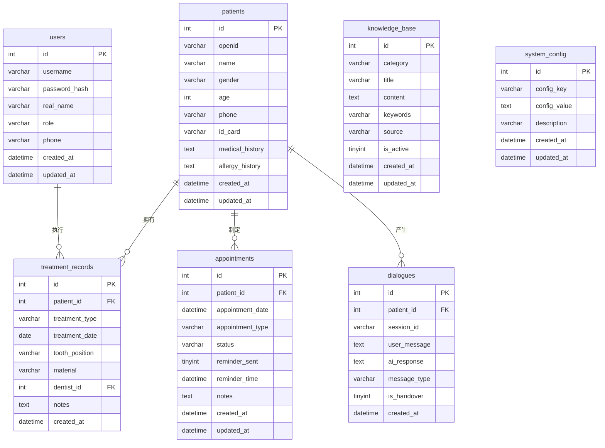

# 数据库 ER 图设计文档

## 1. ER 图概述

本系统数据库采用 **ER 模型（实体 - 关系模型）** 设计，共包含 7 个实体（表），实体之间通过外键建立关联关系。

---

## 2. 实体列表

| 实体编号 | 实体名称 | 对应表名 | 说明 |
|:--------:|----------|----------|------|
| E1 | 用户（User） | `users` | 医护人员账号信息 |
| E2 | 患者（Patient） | `patients` | 患者基本信息 |
| E3 | 治疗记录（TreatmentRecord） | `treatment_records` | 患者治疗历史 |
| E4 | 复诊计划（Appointment） | `appointments` | 复诊预约信息 |
| E5 | 对话记录（Dialogue） | `dialogues` | AI 对话日志 |
| E6 | 知识库（KnowledgeBase） | `knowledge_base` | 牙科专业知识 |
| E7 | 系统配置（SystemConfig） | `system_config` | 系统参数配置 |

---

## 3. 实体属性详情

### 3.1 用户实体（User）

```
┌─────────────────────────────────────────┐
│              users（用户）               │
├─────────────────────────────────────────┤
│ PK  id            INT         主键      │
│     username      VARCHAR(50) 用户名    │
│     password_hash VARCHAR(255) 密码     │
│     real_name     VARCHAR(50) 真实姓名  │
│     role          VARCHAR(20) 角色      │
│     phone         VARCHAR(20) 手机号    │
│     created_at    DATETIME    创建时间  │
│     updated_at    DATETIME    更新时间  │
└─────────────────────────────────────────┘
```

### 3.2 患者实体（Patient）

```
┌─────────────────────────────────────────┐
│             patients（患者）             │
├─────────────────────────────────────────┤
│ PK  id              INT       主键      │
│     openid          VARCHAR(64) 微信 ID │
│     name            VARCHAR(50) 姓名    │
│     gender          VARCHAR(10) 性别    │
│     age             INT       年龄      │
│     phone           VARCHAR(20) 手机号  │
│     id_card         VARCHAR(18) 身份证  │
│     medical_history TEXT      既往病史  │
│     allergy_history TEXT      过敏史    │
│     created_at      DATETIME  注册时间  │
│     updated_at      DATETIME  更新时间  │
└─────────────────────────────────────────┘
```

### 3.3 治疗记录实体（TreatmentRecord）

```
┌─────────────────────────────────────────┐
│         treatment_records（治疗记录）    │
├─────────────────────────────────────────┤
│ PK  id              INT       主键      │
│ FK  patient_id      INT       患者 ID   │
│     treatment_type  VARCHAR(50) 治疗类型│
│     treatment_date  DATE      治疗日期  │
│     tooth_position  VARCHAR(50) 牙位    │
│     material        VARCHAR(100) 材料   │
│ FK  dentist_id      INT       医生 ID   │
│     notes           TEXT      备注      │
│     created_at      DATETIME  创建时间  │
└─────────────────────────────────────────┘
```

### 3.4 复诊计划实体（Appointment）

```
┌─────────────────────────────────────────┐
│           appointments（复诊计划）       │
├─────────────────────────────────────────┤
│ PK  id                INT     主键      │
│ FK  patient_id        INT     患者 ID   │
│     appointment_date  DATETIME 复诊日期 │
│     appointment_type  VARCHAR(50) 类型  │
│     status            VARCHAR(20) 状态  │
│     reminder_sent     TINYINT  已提醒   │
│     reminder_time     DATETIME 提醒时间 │
│     notes             TEXT     备注     │
│     created_at        DATETIME 创建时间 │
│     updated_at        DATETIME 更新时间 │
└─────────────────────────────────────────┘
```

### 3.5 对话记录实体（Dialogue）

```
┌─────────────────────────────────────────┐
│            dialogues（对话记录）         │
├─────────────────────────────────────────┤
│ PK  id            INT        主键       │
│ FK  patient_id    INT        患者 ID    │
│     session_id    VARCHAR(64) 会话 ID   │
│     user_message  TEXT       用户消息   │
│     ai_response   TEXT       AI 回复    │
│     message_type  VARCHAR(20) 消息类型  │
│     is_handover   TINYINT    人工接管   │
│     created_at    DATETIME   对话时间   │
└─────────────────────────────────────────┘
```

### 3.6 知识库实体（KnowledgeBase）

```
┌─────────────────────────────────────────┐
│          knowledge_base（知识库）        │
├─────────────────────────────────────────┤
│ PK  id          INT          主键       │
│     category    VARCHAR(50)  分类       │
│     title       VARCHAR(200) 标题       │
│     content     TEXT         内容       │
│     keywords    VARCHAR(255) 关键词     │
│     source      VARCHAR(200) 来源       │
│     is_active   TINYINT      是否启用   │
│     created_at  DATETIME     创建时间   │
│     updated_at  DATETIME     更新时间   │
└─────────────────────────────────────────┘
```

### 3.7 系统配置实体（SystemConfig）

```
┌─────────────────────────────────────────┐
│         system_config（系统配置）        │
├─────────────────────────────────────────┤
│ PK  id           INT         主键       │
│     config_key   VARCHAR(100) 配置键    │
│     config_value TEXT        配置值     │
│     description  VARCHAR(255) 说明      │
│     created_at   DATETIME    创建时间   │
│     updated_at   DATETIME    更新时间   │
└─────────────────────────────────────────┘
```

---

## 4. 实体关系

### 4.1 关系列表

| 关系编号 | 关系名称 | 关联实体 | 关系类型 | 说明 |
|:--------:|----------|----------|----------|------|
| R1 | 拥有 | 患者 → 治疗记录 | 1:N | 一个患者可有多条治疗记录 |
| R2 | 执行 | 用户 → 治疗记录 | 1:N | 一个医生可执行多条治疗记录 |
| R3 | 制定 | 患者 → 复诊计划 | 1:N | 一个患者可有多个复诊计划 |
| R4 | 产生 | 患者 → 对话记录 | 1:N | 一个患者可产生多条对话记录 |

### 4.2 关系详细说明

```
                    ┌─────────────┐
                    │   users     │
                    │  （用户）    │
                    └──────┬──────┘
                           │ 1:N 执行
                           ▼
┌─────────────┐      1:N      ┌───────────────────┐
│  patients   │──────────────▶│ treatment_records │
│  （患者）    │    拥有        │   （治疗记录）     │
└──────┬──────┘               └───────────────────┘
       │
       ├────────────── 1:N 制定 ──────────────┐
       │ 1:N 产生                              ▼
       ▼                              ┌─────────────┐
┌─────────────┐                       │ appointment │
│  dialogues  │                       │（复诊计划）  │
│ （对话记录） │                       └─────────────┘
└─────────────┘
```

**关系说明**：
- **users → treatment_records**：一个医生可以执行多条治疗记录（1:N）
- **patients → treatment_records**：一个患者可以有多条治疗记录（1:N）
- **patients → appointments**：一个患者可以有多个复诊计划（1:N）
- **patients → dialogues**：一个患者可以产生多条对话记录（1:N）

---

## 5. ER 图（Mermaid 格式）



---

## 6. 外键约束说明

| 外键名 | 所在表 | 关联表 | 约束类型 | 删除策略 |
|--------|--------|--------|----------|----------|
| `fk_tr_patient` | `treatment_records` | `patients` | 外键 | CASCADE（级联删除） |
| `fk_tr_dentist` | `treatment_records` | `users` | 外键 | SET NULL（置空） |
| `fk_app_patient` | `appointments` | `patients` | 外键 | CASCADE（级联删除） |
| `fk_dia_patient` | `dialogues` | `patients` | 外键 | CASCADE（级联删除） |

---

## 7. 索引设计

### 7.1 主键索引

| 表名 | 主键字段 | 索引类型 |
|------|----------|----------|
| `users` | `id` | PRIMARY KEY |
| `patients` | `id` | PRIMARY KEY |
| `treatment_records` | `id` | PRIMARY KEY |
| `appointments` | `id` | PRIMARY KEY |
| `dialogues` | `id` | PRIMARY KEY |
| `knowledge_base` | `id` | PRIMARY KEY |
| `system_config` | `id` | PRIMARY KEY |

### 7.2 唯一索引

| 表名 | 字段 | 索引名 | 说明 |
|------|------|--------|------|
| `users` | `username` | `uk_username` | 用户名唯一 |
| `patients` | `openid` | `uk_openid` | 微信 ID 唯一 |
| `system_config` | `config_key` | `uk_config_key` | 配置键唯一 |

### 7.3 普通索引

| 表名 | 字段 | 索引名 | 用途 |
|------|------|--------|------|
| `patients` | `phone` | `idx_phone` | 加速手机号查询 |
| `treatment_records` | `patient_id` | `idx_patient_id` | 加速患者治疗记录查询 |
| `treatment_records` | `dentist_id` | `idx_dentist_id` | 加速医生治疗记录查询 |
| `treatment_records` | `treatment_date` | `idx_treatment_date` | 加速日期范围查询 |
| `appointments` | `patient_id` | `idx_patient_id` | 加速患者复诊计划查询 |
| `appointments` | `appointment_date` | `idx_appointment_date` | 加速日期查询 |
| `appointments` | `status` | `idx_status` | 加速状态筛选 |
| `dialogues` | `patient_id` | `idx_patient_id` | 加速患者对话查询 |
| `dialogues` | `session_id` | `idx_session_id` | 加速会话查询 |
| `dialogues` | `created_at` | `idx_created_at` | 加速时间排序 |
| `knowledge_base` | `category` | `idx_category` | 加速分类查询 |
| `knowledge_base` | `keywords` | `idx_keywords` | 加速关键词检索 |

---

**文档版本**：v1.2
**设计日期**：2026-02-21
